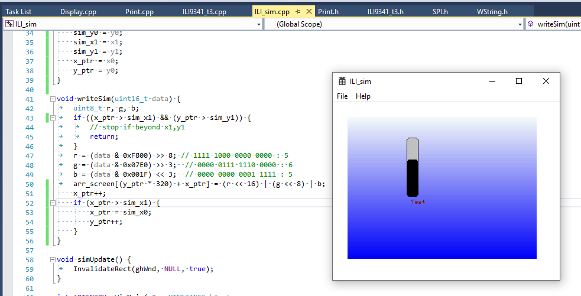
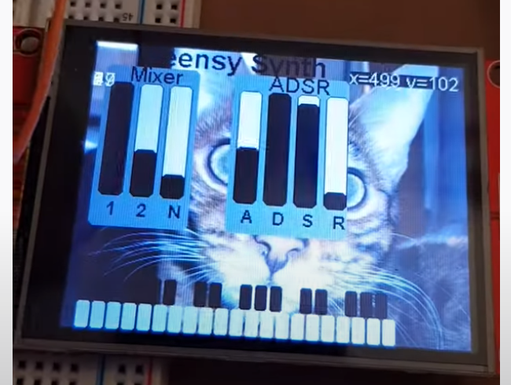

This is a VS2013 project to create an ILI9341 simulator. 

This is done by using the ILI9341_t3 driver code and as little
of the Arduino infrastructure required to make it compile but
then at the core the SPI routines to send command and data to
the display are replaced by routines to intercept the data
flow and feed it to writes in a COLORREF array whis is then
blitted to a window in WM_PAINT.

(or that's the plan anyway) 

This is so that display output can easily be visualized on
a PC without having to repeatedly flash a Teensy (or even need
Teensy/ILI9341 hardware at all) 

Update: hang on to your hat but this is the first ever picture
of the sim kind of working. This was supposed to be a blue/white
graduated fill but it turned out a bit more "rainbow" but that's
hopefully just a colour mapping issue....

LATER: So this was the first time the sim ran and actually
displayed exactly what Teensy4/ILI9341 would have shown:

And this is an exceprt from a Youtube video showing the
real screen in action;

and with just minor changes (to do with background and
small placement changes) this is the real Teensy code
being run in the simulator:

(this has actually worked out much better than I
hoped!)

The key thing is going to be grouping all the application's
drawing stuff into a separate file so that can be slotted
into the simulator to see how it looks !

## ILI9341 simulation

The main way the ILI9341 display works is shown by this detail
from the datasheet and specifcially the flowchart. 

It has commands for Column Address Select which set the start 
and end X values to set the horizontal range in which writes
will occur. Then a similar Page Address Select does the same
in Y to set start and end points. Together they define the
limits of a rectangle.

As the flowchart shows, after CASET and PASET have first been
used to set start column, end column, start page and end page
then repeated data is pushed to the display (in 5:6:5 format
using 16 bits) to write across the rows and down the lines within
the bounds of the predefined rectangle.

This is what happens at the heart of ILI9341_t3. To simulate
the same is done - when setAddr(x0, y0, x1, y1) is used the
simulator just caches those and sets x and 7 start points 
to the top left. Then when writedata16_cont() and writedata16_last()
are called the simulator just writes into a subsection of the
display array incrementing X until it reaches the right margin
then returns to the X start value and increments the Y value.

So the array is simply filled just as the ILI display RAM would be. 
All that then remains is for the display array to be blitted
onto the display regularly (a WM_TIMER set to 5ms is used).

After each blit the min and max X and Y seen in setAddr() calls
are reset. Then for each setAddr the min and max of each are noted.

When the sim comes to update it does so by using a Windows
InvalidateRect call and the limits of the RECT that are passed
are the min and max of all the intervening setAddr() limits so
only the area that has seen changes are invalidated to be
forced to redraw when the WM_PAINT then arrives.