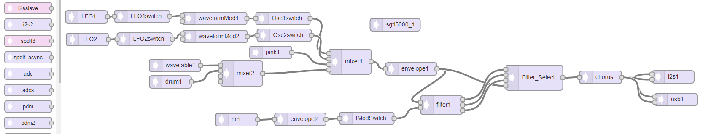
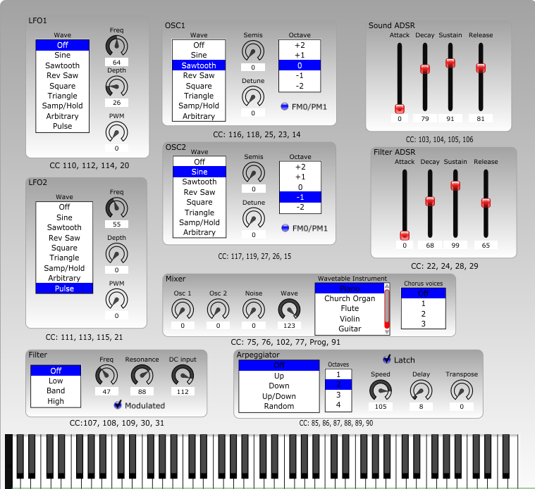
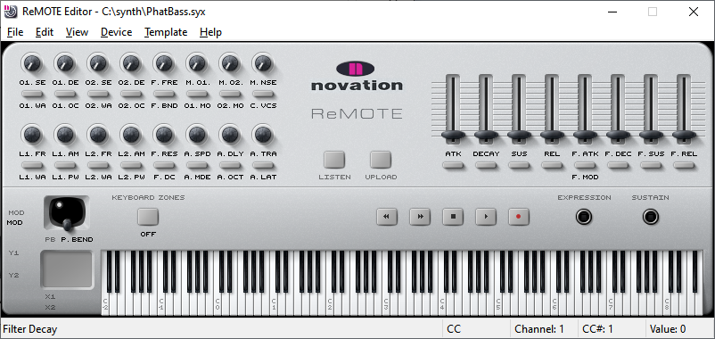
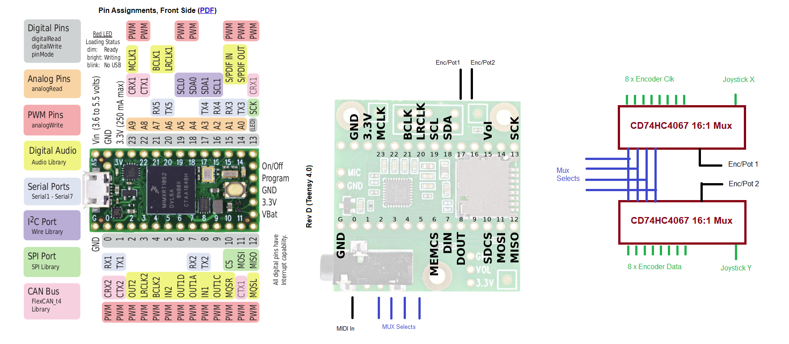
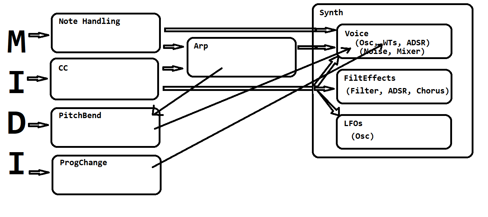

    

### A project to make a synth using Teensy 4 and Audio Adapter

The current layout, as seen in INO file, where connections can be pasted back
into https://www.pjrc.com/teensy/gui/ looks like this:

The Pure Data for my keyboard and controllers looks like this:

(this is just to prototype the UI until there's real 
knobs and keys - the PD sends MIDI that Teensy receives
as usbMIDI).

Later I discovered "Ctrlr" which does the same but in a prettier way...

Having received a bargain Novation Remote from ebay (£32!!) then I used
its editor to define this control layout that hopefully matches the Ctrlr
layout above:

And this is a rough (very rough!) layout diagram to show how some
of the bits connect together (I won't call it "schematic" as it doesn't
deserve that title!):

Read the WIKI: https://github.com/wrightflyer/Synth/wiki for more details
about the hardware and the software and just how it all came about!

This is the dataflow in the class based polyphonic phatBass:

