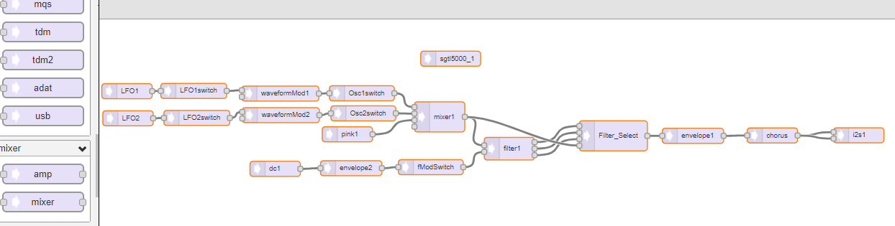
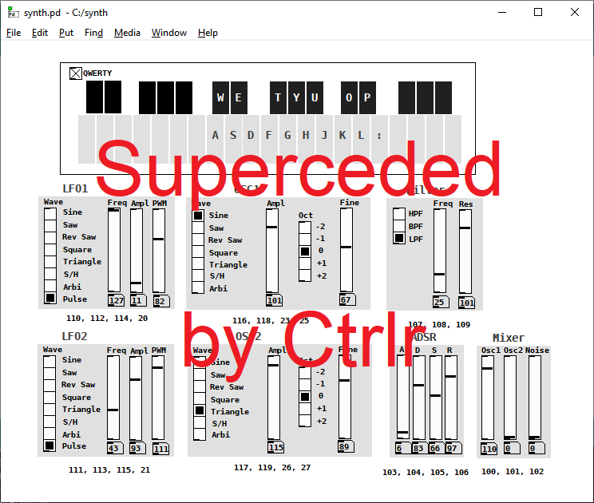

    

### A project to make a synth using Teensy 4 and Audio Adapter

The current layout, as seen in INO file, where connections can be pasted back
into https://www.pjrc.com/teensy/gui/ looks like this:

The Pure Data for my keyboard and controllers looks like this:

(this is just to prototype the UI until there's real 
knobs and keys - the PD sends MIDI that Teensy receives
as usbMIDI).

Read the WIKI: https://github.com/wrightflyer/Synth/wiki for more details
about the hardware and the software and just how it all came about!
